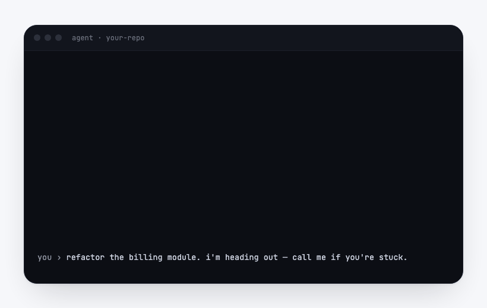

# screenless

**A phone line for your team and its coding agents.** Walk away from the
keyboard and your agents don't stall: when one hits a decision only a person
can make, it phones you — or anyone on your team — takes your answer out loud,
and keeps working. Unblocked from anywhere. No screen.



## What it is

screenless is a CLI and a small Cloudflare Worker that give a team a shared
phone number wired to the terminals it runs. The number goes both ways:

- **Ring in** — a teammate calls the line and speaks a request, a decision, an
  idea. It is transcribed and routed to whoever is running `screenless watch`:
  the caller's own terminal first, any teammate's otherwise, a queue that holds
  up to a week when nobody is. Their agent picks it up and acts.
- **Ring out** — `screenless call "…" --to alex@team.com`, or `--all`. Dial one
  teammate or the whole team and each conversation returns as a transcript. It
  only ever reaches verified numbers on your own team.
- **Skills** — a *skill* is a prompt that points those primitives at a job. Two
  ship as examples; the CLI is the tooling you build the rest on.

### The skills that ship

- **screenless** — the nightly loop. It reads your repo's pull requests and
  tickets, calls each person about the few decisions that are theirs, and hands
  the transcript to your own agent, which does the work. On Saturdays it also
  builds a weekly team paper: who shipped what, and the week ahead.
- **call-when-afk** — tell your agent you are stepping out and it stops pausing
  on questions. It phones you each one and continues the moment you answer.

Install the skills into any coding agent — Claude Code, Cursor, Codex, and the
rest — with one command via [skills.sh](https://skills.sh):

```bash
npx skills add janwilmake/screenless
```

Or get everything, the CLI included, from the one-line installer below.

## The one rule

The voice on the phone has no tools and no credentials. It collects decisions
and hangs up; a terminal on your own machine — with the MCPs, the logged-in
browser and the Claude subscription you already gave it — is what merges,
comments, and closes. A teammate's request arrives marked as untrusted, weighed
before it runs with your access. Nothing leaves your machines but a question and
an answer.

## How it installs

```bash
curl -fsSL https://screenless.sh/install | bash
```

One command: the CLI lands in `~/.screenless`, gets a launcher on your PATH,
installs the branded skills into every coding agent it finds (Claude Code,
Cursor, Codex, …), and goes straight into `screenless setup` — phone
verification by SMS, no card. Every new team starts with **$10 of free call
credit**; after that calls bill pay-as-you-go at ~30¢/minute from the team's
shared balance. Node 20+ required and never installed for you.

Just want the skills in your agents, without the CLI? They live under
`skills/` and install with one command via [skills.sh](https://skills.sh):

```bash
npx skills add janwilmake/screenless
```

Both surfaces are built by a **loop armed inside a Claude Code session on your
own machine**:

```
/screenless start      # in Claude Code, in a repo you ran `screenless init` in
```

It runs one tick, then blocks in pure shell — `screenless wait`, probing every
minute, no model, no tokens — until there is something to do: 03:00 (or the
first minute after the laptop wakes), or a finished call whose decisions nobody
has applied. The exit wakes the agent, which builds the paper and the brief, or
applies what you decided on the phone, with the permissions, MCPs and browser
the session already has. Leave the window open; `/screenless stop` ends it.

It is deliberately a session and not a scheduler. The first version was two
launchd jobs running `claude -p`; they could not read a repo under `~/Desktop`,
could not approve a tool call, and fired every night for four nights without
shipping a page. The orchestrator already runs as an armed session for the same
reason, and this is the same contract. That is the whole integration story:

- **Your MCP servers are the integrations.** Linear, GitHub, Slack, your ATS —
  whatever you have already connected, it can already read. There is no OAuth
  app to install, no third-party grant to review, no integration matrix to build
  or maintain.
- **Your browser is the screenshot tool.** The paper's visuals come from driving
  a real session against your real app, already logged in. A hosted service
  cannot do this without credentials you should not give it.
- **Your Claude subscription is the LLM.** Nothing is metered per token by us.
- **Nothing leaves your machine** except the phone call and the email.

This is the same reason `linear-orchestrator` runs locally: the agents need your
repo, your dev server, and your browser. screenless sits on the same substrate
and inherits the same access.

## Status — read this before anything else

The **line is real and proven**: calling out, ringing in, calling teammates,
transcription, routing to a watching terminal, pay-as-you-go billing, teams
and invites — all of it works on real phones today, in production at
screenless.sh. Verified end to end with live calls, including a teammate
speaking a request that an agent picked up and acted on.

What is **still early is the intelligence in the skills**. The morning
briefing's hard part — reading a queue of pull requests and picking out the
few that genuinely need a person, then writing that back — is being built in
the open. `call-when-afk` and the calling primitives work now; the nightly
loop and the weekly paper render and deliver, but have not run unattended
against a real repo for a full week, which is the only test that counts.

So: install it, use the line and `call-when-afk` today, and help shape what
the briefing becomes.

## How the call fits together

```
  CLI  ──────────────►  Cloudflare Worker  ──────────────►  Telnyx
 (your laptop)              (holds the API key)          (Verify + AI Assistant)
       ▲                          ▲
       │  poll GET /calls/:id     │  status + conversation webhooks
       └──────────────────────────┘
```

Three decisions worth knowing about:

**The API key lives in the Worker, never the CLI.** The CLI holds only a session
token bound to your verified phone number.

**Your phone number *is* your identity.** `screenless setup` sends an OTP via the
Telnyx Verify API; entering the code mints the session. No OAuth provider, no
password.

**You can only call verified numbers on your own team.** A self-call takes
`To` from the session token; a teammate call resolves targets to members of
your own org with a verified phone, and refuses anything else. Either way the
number is never a free-form value from the request body — which keeps this
structurally incapable of becoming a dialer, and matters given Dutch
telemarketing law (see [Legal](#legal-if-you-ever-point-this-at-someone-else)).

The Worker is also the webhook receiver, so the CLI never needs a tunnel — it
just polls.

## Why a call, and not a notification

The notification tier is commoditised. Claude Code ships first-party push;
several free tools do desktop and Telegram alerts; Pushary does two-way approval
from a lock screen. All of them are **session-scoped**: one agent, one block, one
ping, one answer.

This is **portfolio-scoped and scheduled**. It is not an interrupt — it is a
standing meeting you opted into, draining a prioritised queue across every PR
your agents opened last night. That needs cross-PR state, an agenda, and
writeback, none of which a per-tool-call hook grows into.

The nearest thing to this shape is a generated audio digest, and the reason that
format loses is that **you cannot interrupt it**. Half the value above is the
line where you cut in with "wait, why is that in a ticket about export?" A live
call has that property for free.

## Economics

Telnyx bills roughly **$0.056–0.07/minute** all-in ($0.05 voice AI + ~$0.004 LLM
+ telephony).

| Call length | Minutes/mo (22 workdays) | COGS/mo |
| ----------- | ------------------------ | ------- |
| 30 min/day  | 660                      | $37–46  |
| 15 min/day  | 330                      | $18–23  |
| 10 min/day  | 220                      | $12–15  |

Pricing is **pay-as-you-go at 30¢/minute** — roughly double the COGS, so every
minute carries a ~50–60% gross margin and heavy users pay in proportion instead
of inverting the incentive the way a flat subscription did *(was: $99/month with
a 7-day trial, where a 30-minute daily caller ate most of the price in
telephony)*. Every org starts with $10 of credit free — about half an hour of
call — and tops up from the billing tab when it runs out.

- **The COGS is also the moat.** No first-party vendor will bundle real
  telephony into a flat subscription, which is exactly why the notification tier
  got commoditised and this one will not.
- **The weekly paper carries almost no COGS**, since it runs on your machine
  against your own Claude subscription — only the calls meter.

Verification is charged separately: **$0.03 per successful verify plus $0.091 per
SMS to a Dutch number** — billed even on failed attempts, which is why
`/auth/start` is rate-limited to 5/hour per number.

## Setup

You need a [Telnyx account](https://telnyx.com/sign-up) and a Cloudflare account.
Budget about 20 minutes.

**Only Telnyx is required — there is no separate Deepgram account.** Telnyx hosts
the Deepgram models, selected via `transcription.model` in the assistant config,
and bills them inside the $0.05/min. You would only need your own Deepgram or
ElevenLabs key to bypass Telnyx's hosting (ElevenLabs voices require one, passed
as `api_key_ref`).

### 1. Telnyx: get a number and a key

1. Buy a phone number. For a business, a Dutch **national** number is the easiest
   legitimate option — it needs a Dutch address but no area-code match and no
   proof-of-address document. **Local** (+31 geographic) numbers additionally
   require an address in the matching area code plus proof dated within 3 months.
   **Mobile** numbers have the lightest KYC but are flagged A2P-only, which is a
   poor fit for a conversational agent.
2. Create an API key under **API Keys**.
3. Set your **AnchorSite** on the outbound voice profile to the region nearest
   your users. This is the whole reason for choosing Telnyx — their GPUs are
   co-located with the telephony PoPs, so inference sits next to the SIP edge.

### 2. Cloudflare: deploy the Worker

```bash
cd worker
npm install

# KV stores call records, briefs, watcher heartbeats, rate-limit counters
npx wrangler kv namespace create CALLS

# D1 stores users, orgs, invites and the money ledger
npx wrangler d1 create screenless
npx wrangler d1 execute screenless --remote --file=schema.sql
```

Edit `wrangler.jsonc`: set `TELNYX_FROM_NUMBER` to the number you bought, the
KV and D1 ids, and — see the warning in that file — an `ASSISTANT_VOICE`
matching your default language.

```bash
npx wrangler secret put TELNYX_API_KEY      # from step 1
npx wrangler secret put SESSION_SECRET      # openssl rand -base64 32
npx wrangler secret put ADMIN_SECRET        # openssl rand -base64 32
npx wrangler deploy
```

### 3. Create the Verify profile

Telnyx requires a `verify_profile_id` on every OTP. The Worker has a one-shot
admin endpoint for this:

```bash
curl -X POST https://api.screenless.sh/admin/verify-profile \
  -H "X-Admin-Secret: <your ADMIN_SECRET>"
```

It returns an id scoped to the countries in `ALLOWED_DESTINATIONS`. Store it and
redeploy:

```bash
npx wrangler secret put TELNYX_VERIFY_PROFILE_ID
npx wrangler deploy
```

### 4. Stripe: topping up

Billing stays inert while `STRIPE_SECRET_KEY` is unset, so skip this section
entirely if you are running your own Worker for yourself — every org is then
entitled whatever its balance says.

Pay-as-you-go needs no product or price objects: a topup is a one-time Checkout
payment with the amount set per session, credited to the org by the webhook (or
by the billing page's own poll, if the webhook never lands).

```bash
stripe webhook_endpoints create \
  --url="https://screenless.sh/stripe/webhook" \
  --enabled-events=checkout.session.completed \
  --enabled-events=checkout.session.async_payment_succeeded
```

```bash
npx wrangler secret put STRIPE_SECRET_KEY      # sk_test_… or sk_live_…
npx wrangler secret put STRIPE_WEBHOOK_SECRET  # whsec_… from the command above
npx wrangler deploy
```

Every new org is granted `FREE_CREDIT_CENTS` (default $10) exactly once, calls
debit `PRICE_PER_MINUTE_CENTS` (default 30¢) per minute, and both are plain vars
in `wrangler.jsonc`. Going live is the two secrets swapped for their live-mode
equivalents — there is no code path that differs.

### 5. Inbound: let people ring back

So a declined morning call can be taken later, the number has to answer. Ask the
Worker for its signed voice URL:

```bash
curl https://api.screenless.sh/admin/inbound-url -H "X-Admin-Secret: <ADMIN_SECRET>"
```

In the Telnyx portal, set that as the Voice URL (POST) of a TeXML application
and assign `TELNYX_FROM_NUMBER` to it. A team member who rings in hears no
voice at all — just a beep: say what you need, hang up, and the recording is
transcribed and routed to whichever teammate's terminal is running
`screenless watch` — the caller's own first, anyone's otherwise, and a queue
that holds up to a week when nobody is. A caller who is not on any team gets
a short robot voice pointing them at screenless.sh.

### The team

One org per user, billing per org. `screenless team` (or screenless.sh/team)
opens the page: invite by email only — the invitee verifies their own phone on
accept, and can re-enter it any time if it was typed wrong — with roles, an
invite list that shows pending and expired, and an admin-only billing tab with
the balance, topups, per-day usage and who-costs-what.

### 6. Install the CLI

```bash
curl -fsSL https://screenless.sh/install | bash
```

That fetches the CLI into `~/.screenless`, puts a launcher on your PATH, and
drops straight into `screenless setup`. It needs Node 20+ and will not install
it for you.

The call goes out at 08:00 in **your machine's timezone**, which is read from
the machine itself on every settings call — there is no timezone to configure,
and moving country corrects the schedule on its own.

Setup asks `Self-hosted Worker? y/N` first. Answering no — the default — points
at `https://screenless.sh` (`api.screenless.sh` still answers for older
configs). Answering yes prompts for your own Worker URL, and `--api <url>`
skips the question entirely.

Working on the CLI itself:

```bash
cd ../cli
npm install && npm run build && npm link
screenless setup --api https://screenless.sh
```

Either way you'll get an SMS with a code (`--voice` gets you a phone call
instead). Enter it and you're done — the session lasts a year and lands in
`~/.screenless/config.json` at mode 0600.

Publishing anything — a CLI change, a page edit, a change to the loop skills —
is one command:

```bash
cd site && npm run deploy
```

`site/public/` is generated in full by `site/build.sh` and gitignored. Edit
`site/src/` for the pages and installer, `skills/` for the branded skills,
`cli/src/` for the CLI; never edit `site/public/`, because the next build
deletes it.

## Usage

```bash
screenless call "<prompt>"           # the prompt becomes the agent's instructions
screenless call "..." --lang en      # English (default)
screenless call "..." --lang nl      # Dutch
screenless call "..." --lang multi   # Dutch/English code-switching
screenless call "..." --json         # raw result, for piping

screenless call "..." --at           # park it for your configured call time
screenless call "..." --at 06:30     # park it for a specific local time
screenless call "..." --hold         # park with no time — waits until you ring in

screenless transcript                # what was decided on the last call
screenless transcript --wait --json  # block until it ends, then emit JSON

screenless settings                       # call time, timezone, ring-back number
screenless settings --at 08:00            # when the morning call goes out (default 08:00)
screenless settings --pause               # stop the scheduled call

screenless billing            # credit left, and the price per minute
screenless billing --manage   # open the team billing tab (admins top up there)

screenless team               # your team: members, credit, the page
screenless watch              # block until a team call lands, print it, exit
screenless done <callId>      # ack it once the work actually ran — undone
                              # calls are re-delivered, never lost

screenless whoami
screenless logout
```

### The nightly shape

The loop on your machine writes the brief and parks it; the Worker dials at your
time; the loop reads back what you decided and is the thing that acts on it.
`screenless wait` is the gate the armed session blocks on; the agent does the
rest in-session, but the primitives are plain commands:

```bash
screenless wait                    # blocks until tonight's run; prints NIGHTLY <repo>
screenless watch                   # blocks until a call lands; prints WORK <id>

# 03:00, when your agents are done — the agent builds the brief, then:
screenless call "<brief>" --at     # parked for your call time

# 08:09, after the call — the watcher hands it over, the agent acts:
screenless done <callId>
```

The assistant on the phone has no tools and takes no action — it collects
decisions and hangs up. Everything that merges, comments or closes runs on your
machine, with the access you already gave it. Decline the call and ring the
line whenever suits to leave your decisions or a request as a voice note.

`mail` hands the PDF to the Worker, which parks it in KV and sends it on a
five-minute cron sweep once it comes due. The Worker holds it rather than your
laptop because the machine that builds the paper at 03:00 is usually asleep by
06:30. It needs `RESEND_API_KEY` set as a Worker secret and a verified sender
domain — without them the sweep fails silently, since nobody is watching a cron.

`call` blocks until the call reaches a terminal state, polling every 2s, and
gives up after 15 minutes.

Until `screenless brief` exists, you can approximate it by piping your own PR
summary into the prompt:

```bash
gh pr list --json number,title,body --limit 20 \
  | screenless call "$(cat -)  — walk me through these and ask me to decide on each"
```

That is a demo, not the product: there is no triage, no writeback, and a long
prompt will blow past the 4000-character limit.

## Configuration

Defaults live in `worker/wrangler.jsonc`:

| Var | Default | Notes |
| --- | --- | --- |
| `ASSISTANT_MODEL` | `anthropic/claude-haiku-4-5` | Time-to-first-token is the biggest latency slice |
| `ASSISTANT_VOICE` | *(Dutch — change it)* | See the warning in the file |
| `TELNYX_ANCHORSITE` | `Amsterdam, Netherlands` | Pin media to a region near your users |
| `ALLOWED_DESTINATIONS` | `NL` | Doubles as a spend guard; widen for non-NL users |

`ALLOWED_DESTINATIONS` is the one to revisit first if you take this beyond
yourself — a product for senior engineers that only dials Dutch numbers is not a
product.

### Voices

```bash
cd worker
npm run voices en         # Telnyx-hosted English voices
npm run voices en all     # every provider
npm run voices nl all     # Dutch, all 43
```

Prefer `hosted: true` voices (`Telnyx.Ultra.*`, `Resemble.Pro.*`): they run on
Telnyx's own GPUs, so they need no third-party API key and avoid a network hop
mid-call.

### Latency expectations

Independent benchmarks measuring what a caller actually experiences — end of your
speech to first agent audio, including endpointing and telephony — put every
major platform at **1.3–2.4 seconds**, not the sub-500ms figures in the
marketing. Human conversation gaps average ~200ms; above 800ms callers start
talking over the agent.

For this product that matters less than it would for a snappy assistant. A
deliberative review call has natural pauses — you are thinking about whether the
field belongs in its own table. `eot_threshold` and `eager_eot_threshold` in
`worker/src/telnyx.ts` are the knobs if you want them.

## The silent-call bug (resolved)

For the first fortnight every assistant call was silent — the caller heard
nothing, and the conversation recorded zero assistant turns. The cause was
narrow and upstream: **Telnyx-hosted TTS voices render no audio on a PSTN
call**. Plain TeXML `<Say>` was audible, the assistant worked over text, and
standalone TTS worked — but an assistant speaking through a Telnyx voice on a
phone line produced silence.

The fix was to give each language a third-party voice (AWS Polly / Azure
Neural), chosen on measured latency, rather than a Telnyx-hosted one. Calls
have been audible and interruptible since. `/texml/say` stays in the worker as
the isolation test: point a TeXML application at it and if you hear it,
telephony and TTS are fine and the fault is higher up. See `telnyx-bug/` for
the full reproduction.

## Setup gotchas found the hard way

- **The default outbound voice profile only whitelists US and CA.** Any Dutch
  destination is refused with `D13` until you add `NL`. This is not mentioned
  during number purchase.
- **`StatusCallbackEvent` must be a space-separated string**, not a JSON array,
  unlike the TwiML convention of repeating the parameter.
- **Verify profiles need `whitelisted_destinations` on the `call` channel too**,
  not just `sms` — it is not inherited, and the docs example only shows `sms`.
- **Deleting an assistant does not delete its auto-provisioned TeXML app.** Clean
  both up or they accumulate one per call.
- **Dutch national (+3185) numbers require regulatory approval** that a KvK
  *handelsnaam* may not satisfy. A US number has no requirements and activates
  instantly, which is fine while you only call your own verified phone.

## Legal, if you ever point this at someone else

This tool only calls the number you verified, so none of the below applies to
using it on yourself — which is the entire intended product. It all applies the
moment you point it at anyone else.

- **AI disclosure is mandatory and already in force.** EU AI Act Article 50
  applied 2 August 2026 with no grace period; penalties reach €15M or 3% of
  worldwide turnover. The agent's greeting is hard-coded in `worker/src/index.ts`
  rather than left to the system prompt, because a prompt instruction is
  something the model can silently skip. Don't remove it.
- **You cannot cold-call Dutch consumers.** Opt-in has been required since July
  2021, and as of 1 July 2026 the existing/former-customer exception is gone too.
- **zzp'ers and eenmanszaken count as natural persons** — the most-missed trap,
  and it covers most Dutch self-employed people. Only *rechtspersonen* (BV, NV,
  stichting, vereniging) remain cold-callable.
- **The Bel-me-niet Register no longer exists.** It was abolished and its data
  deleted. Vendor tools still advertising "automatic register checks" are selling
  something that isn't there.
- **Anonymous caller ID is illegal** for telemarketing — your number must be
  visible and answerable.

## Known gaps

- **The product itself.** See [Status](#status--read-this-before-anything-else).
  PR ingestion, triage, agenda, writeback, `screenless brief`, and the entire
  paper surface are unbuilt.
- **Webhook signature verification.** Telnyx signs webhooks with ed25519; the
  Worker checks an HMAC token in the URL instead. Good enough to stop someone who
  guesses a call id, not a substitute for signature verification.
- **One assistant per call**, created and deleted each time. Clean 1:1 mapping to
  the conversation, but it adds a round-trip to call setup. A long-lived
  assistant with per-call dynamic variables would be faster — and is close to
  required for a scheduled daily call.
- **The 4000-character prompt limit** is well below a real PR agenda. Whatever
  builds the agenda will need to summarise before it dials, not stuff context
  into the prompt.

## Layout

```
cli/                       the `screenless` binary — no dependencies, two files
  src/index.ts               setup, call, watch, done, team, mail, billing …
  src/config.ts              ~/.screenless/config.json
worker/                    the one Worker — site, team page, and the whole API
  src/index.ts               routes, calls, inbound IVR, watchers, cron
  src/db.ts                  all state in D1: users, orgs, calls, briefs, ledger …
  src/team.ts                the /team page and its API
  src/billing.ts             pay-as-you-go, Stripe topups
  src/telnyx.ts              Telnyx client — verify, calls, SMS, transcription
  src/mail.ts, emailhtml.ts  outbox (D1 + R2) and the branded email frame
  schema.sql                 the D1 schema
  wrangler.jsonc             vars, bindings, tunable defaults
skills/                    the branded skills — installable via skills.sh
  screenless/                nightly brief + weekly paper
    SKILL.md, APPLY.md         the loop, and the return leg after a call
    press/                     the PDF toolkit the paper skill calls
  call-when-afk/             phone the user their questions while away
site/src/                  the landing page and installer (screenless.sh)
docs/demo.gif              the hero terminal animation
rounds/                    the PR-triage brains of the briefing — planned
```

## License

MIT — see [LICENSE](LICENSE).
